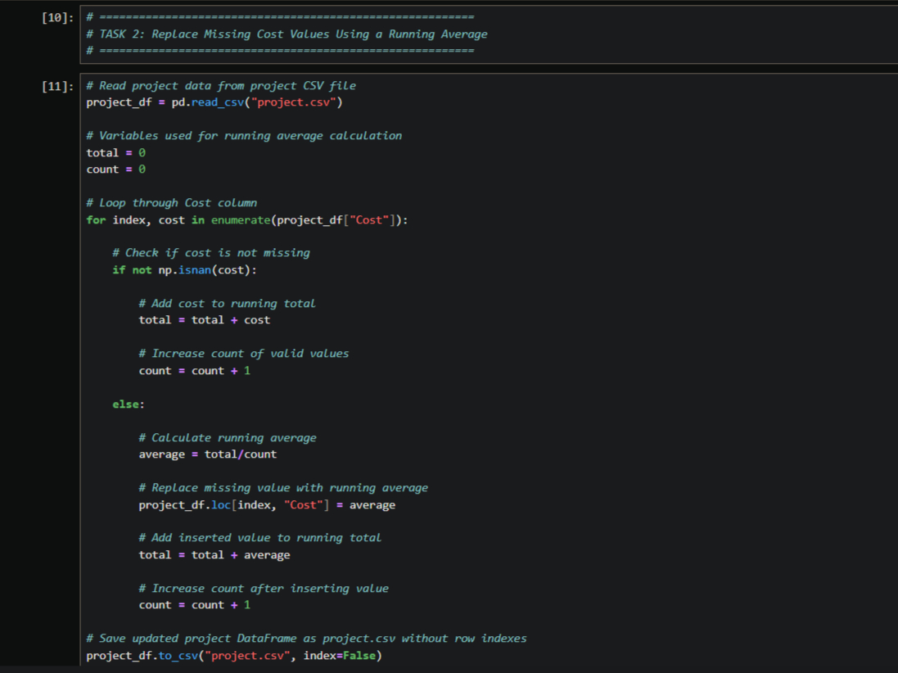
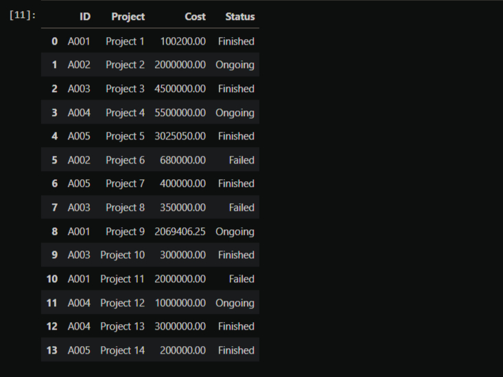
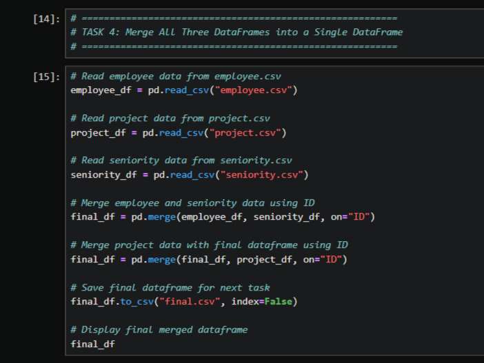
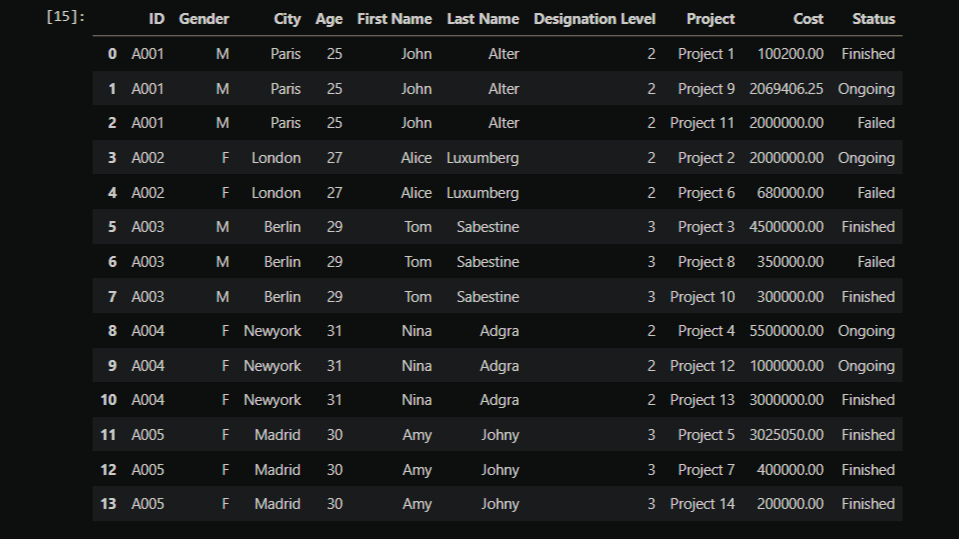
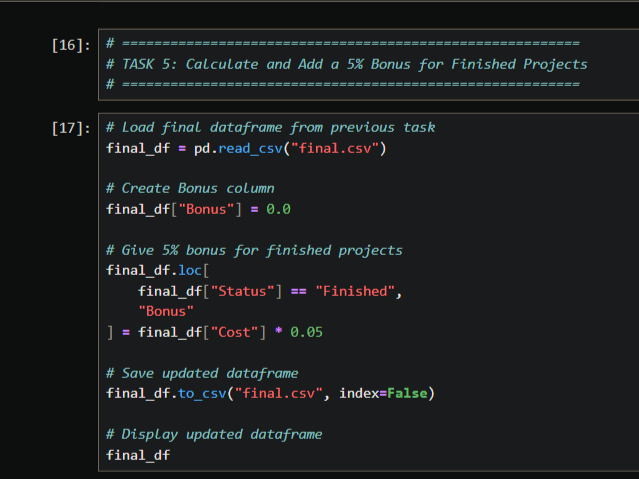
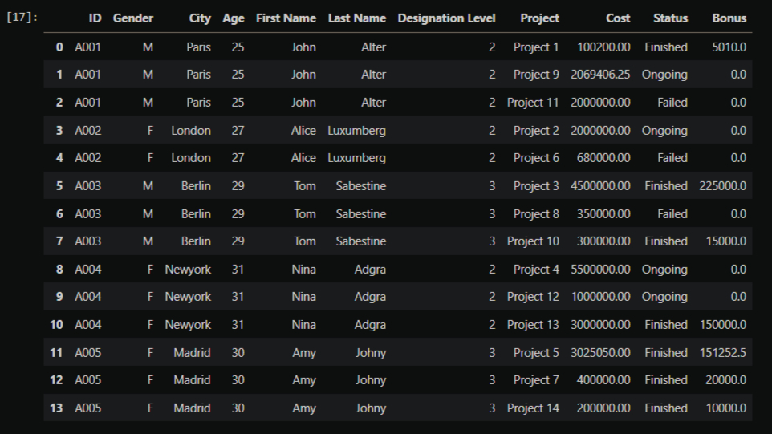
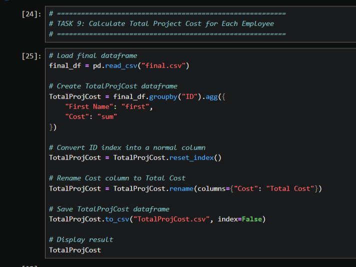
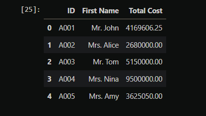

# Python Data Analysis Capstone

A Python-based data analysis project focused on data cleaning, transformation, DataFrame merging, conditional calculations, and data aggregation using Pandas and NumPy.

## Project Overview

This capstone project demonstrates practical Python data analysis techniques by working with multiple CSV datasets and performing a series of data transformation and analysis tasks.

The project covers:

- Reading and processing CSV datasets
- Handling missing values
- Calculating running averages
- Merging multiple DataFrames
- Creating calculated columns
- Applying conditional logic
- Performing group-based aggregation
- Exporting processed results to CSV files

## Tools & Technologies

- Python
- Pandas
- NumPy
- Jupyter Notebook
- CSV

## Tasks Completed

### Task 2 — Replace Missing Cost Values Using a Running Average

Missing values in the `Cost` column were identified and replaced using a running average calculated from previously available cost values.

**Key concepts:**
- `pd.read_csv()`
- `np.isnan()`
- `enumerate()`
- Running total and count
- Conditional logic
- `DataFrame.to_csv()`

#### Solution



#### Output




### Task 4 — Merge All Three DataFrames into a Single DataFrame

Employee, project, and seniority datasets were merged using the common `ID` column to create a consolidated DataFrame.

**Key concepts:**
- Reading multiple CSV files
- `DataFrame.merge()`
- Joining datasets using a common key
- Creating a final merged DataFrame
- Exporting the merged dataset

#### Solution



#### Output




### Task 5 — Calculate and Add a 5% Bonus for Finished Projects

A `Bonus` column was added to the final DataFrame. Projects with a `Finished` status received a bonus equal to 5% of their project cost.

**Calculation:**

`Bonus = Cost × 0.05`

**Key concepts:**
- Conditional filtering
- `.loc[]`
- Calculated columns
- Arithmetic operations
- CSV export

#### Solution



#### Output




### Task 9 — Calculate Total Project Cost for Each Employee

The total project cost for each employee was calculated by grouping the final dataset by employee `ID` and summing the `Cost` values.

**Key concepts:**
- `groupby()`
- `agg()`
- `sum()`
- `reset_index()`
- Column renaming
- Aggregated DataFrame creation
- CSV export

#### Solution



#### Output




## Project Workflow

```text
CSV Datasets
     ↓
Data Loading
     ↓
Data Cleaning
     ↓
Data Transformation
     ↓
DataFrame Merging
     ↓
Conditional Calculations
     ↓
Data Aggregation
     ↓
Final Analysis
     ↓
CSV Export
